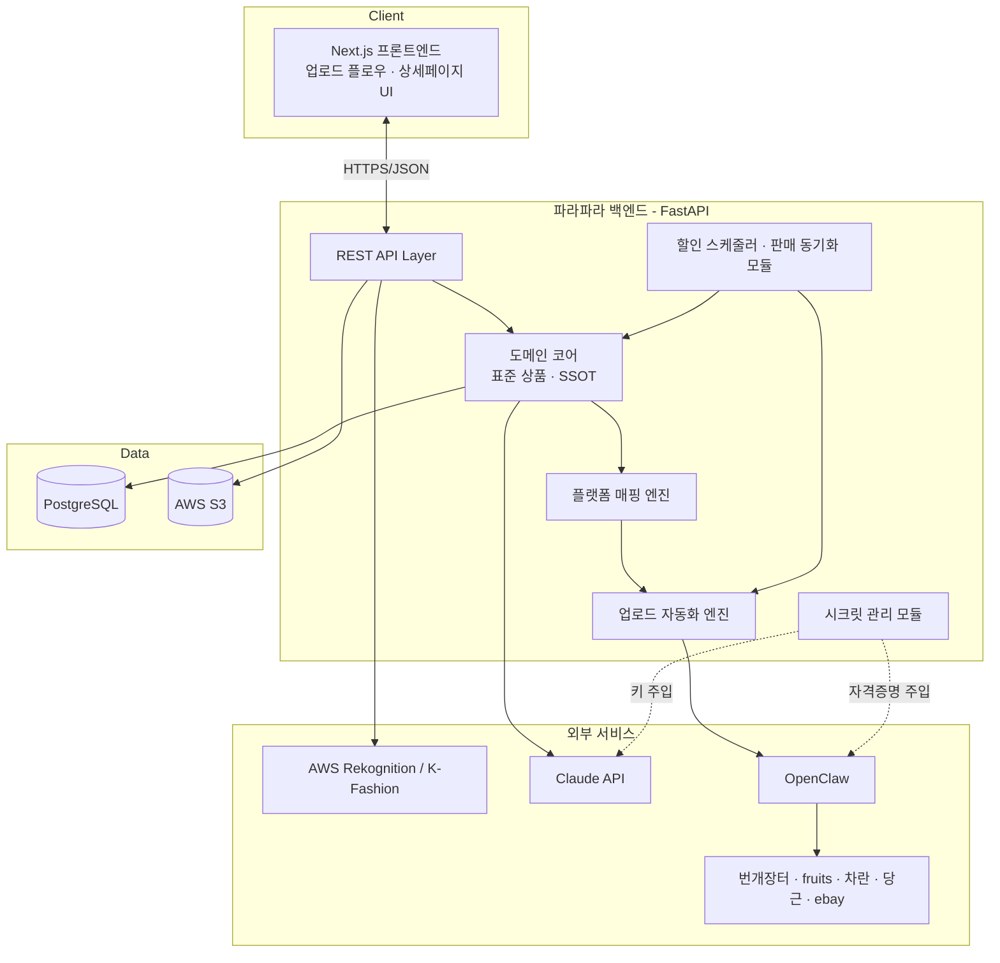
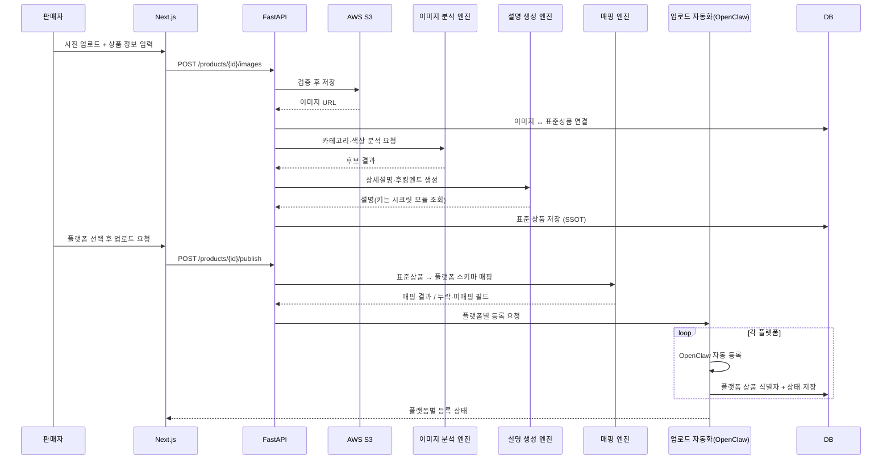
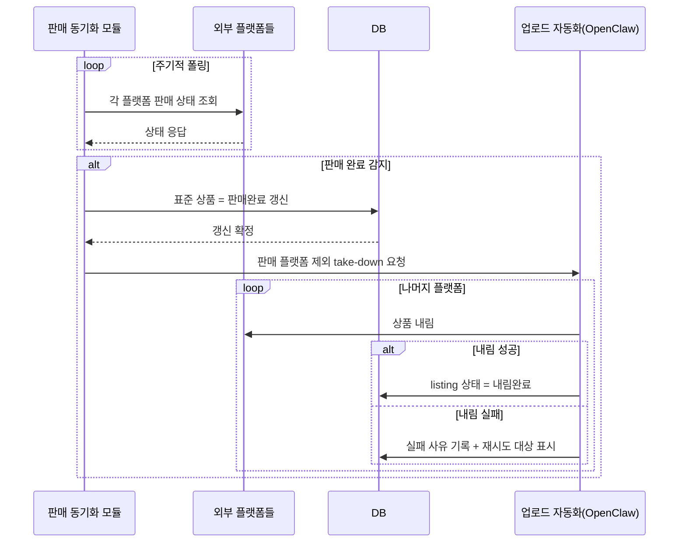

# 설계 문서 (Design Document)

## Overview

**파라파라(ParaPara)** 는 빈티지·중고 의류 판매자를 위한 멀티 플랫폼 업로드 자동화 웹 서비스다. 판매자가 파라파라에 상품을 한 번 등록하면 시스템이 사진 정리·AI 상세정보 작성·썸네일 보정·컨디션 표시를 수행하고, 해당 상품을 번개장터·fruits·차란·당근 등 여러 중고 거래 플랫폼에 자동으로 등록한다.

본 설계의 핵심 원칙은 **단일 진실 공급원(Single Source of Truth, SSOT)** 이다. 파라파라에 저장된 **표준_상품(Canonical Product)** 이 유일한 원본 데이터이며, 각 외부 플랫폼의 상품 등록(Platform Listing)은 이 표준 상품으로부터 **복제(replication)** 된다. 가격 변경, 판매 완료, 상품 내림 등 모든 상태 변화는 표준 상품을 기준으로 전파된다.

### 설계 목표

- **일관성**: 모든 플랫폼 등록물은 표준 상품에서 파생되며, 표준 상품과 항상 정합성을 유지한다.
- **확장성**: 플랫폼 추가(예: ebay)가 코드 변경이 아닌 매핑 설정(config) 추가로 가능하도록 한다.
- **회복 탄력성**: 한 플랫폼의 등록·내림 실패가 다른 플랫폼 작업을 막지 않으며, 실패는 기록·재시도된다.
- **보안**: Claude API 키와 플랫폼 자격 증명은 환경변수/시크릿 저장소에서만 로드하고 소스·로그에 노출하지 않는다.

### 기술 스택

| 영역 | 기술 |
| --- | --- |
| 프론트엔드 | Next.js (App Router), React, TypeScript |
| 백엔드 | FastAPI (Python), Pydantic |
| 데이터베이스 | PostgreSQL (관계형, JSONB 활용) |
| 사진 저장 | AWS S3 |
| 이미지 분석 | AWS Rekognition / K-Fashion 모델 |
| AI 생성 | Claude API (상세설명·후킹멘트·모델명 추론) |
| 플랫폼 자동화 | OpenClaw (번개장터·fruits·차란·당근, 추후 ebay) |
| 인증 (추후) | Google OAuth |
| 작업 스케줄링 | APScheduler / Celery + Redis (할인·폴링) |

## Architecture

### 시스템 컨텍스트

파라파라는 프론트엔드(Next.js)와 백엔드(FastAPI)로 구성되며, 백엔드는 다수의 외부 서비스(S3, Rekognition, Claude, OpenClaw 자동화 대상 플랫폼)와 통신한다.



### 레이어 구조

시스템은 책임 분리를 위해 4개 레이어로 구성한다.

1. **표현 레이어 (Next.js)**: 업로드 플로우 UI, 사진 정렬 UI, 상세페이지 UI(Fruits 벤치마킹). 백엔드 REST API만 호출한다.
2. **API 레이어 (FastAPI 라우터)**: 요청 검증, 인증, 도메인 코어 호출, 응답 직렬화.
3. **도메인 코어**: 표준 상품 모델과 비즈니스 규칙(SSOT 유지, 컨디션 범위, 가격 검증). 외부 서비스에 의존하지 않는 순수 로직 위주로 구성하여 property 기반 테스트 대상이 된다.
4. **인프라/어댑터 레이어**: S3, Rekognition, Claude, OpenClaw, DB에 대한 어댑터. 외부 의존성을 캡슐화하여 코어를 테스트 가능하게 유지한다.

### 비동기 작업 처리

이미지 분석·보정, 멀티 플랫폼 업로드, 할인 스케줄, 판매 폴링은 모두 시간이 오래 걸리거나 주기적이므로 백그라운드 작업 큐(Celery + Redis 또는 FastAPI BackgroundTasks + APScheduler)에서 처리한다. API는 작업을 큐에 넣고 즉시 작업 ID를 반환하며, 프론트엔드는 상태를 폴링하거나 SSE/WebSocket으로 갱신을 수신한다.

## Components and Interfaces

### 1. 사진 업로드 / S3 모듈 (Photo Upload Module)

- **책임**: 이미지 파일 검증(확장자·크기), S3 저장, URL 반환, 표준 상품 연결.
- **주요 인터페이스**:
  - `upload_images(product_id, files) -> list[ImageRef]`
  - 확장자(jpg/jpeg/png/webp), 크기(≤10MB) 검증. 실패 시 오류 코드 반환, 표준 상품에 연결하지 않음.
- **연관 요구사항**: Requirement 1

### 2. 사진 정렬 모듈 (Photo Ordering Module)

- **책임**: 사진 역할(앞/확대/뒤/디테일/오염/태그) 배정 및 정렬 순서 산출.
- **주요 인터페이스**:
  - `assign_role(image_id, role)`
  - `order_images(images) -> list[Image]` — 역할 우선순위 순서로 정렬하되 동일 역할 내 판매자 지정 순서 유지.
  - `validate_ordering(images)` — '앞' 역할 사진 존재 검증.
- **역할 정렬 순서**: `앞(0) → 확대(1) → 뒤(2) → 디테일(3) → 오염(4) → 태그(5)`
- **연관 요구사항**: Requirement 2, 13.2

### 3. 이미지 분석 엔진 (Image Analysis Engine)

- **책임**: AWS Rekognition / K-Fashion 모델로 카테고리·색상 후보 생성.
- **주요 인터페이스**:
  - `analyze(image_refs) -> AnalysisResult{category_candidates, color_candidates}`
- **동작**: 결과를 표준 상품 기본값으로 채우되 판매자 수정 허용. 실패 시 빈 값으로 두고 수동 입력 요청.
- **연관 요구사항**: Requirement 3

### 4. 설명 생성 엔진 (Description Generation Engine)

- **책임**: Claude API로 상세 설명 + 후킹 멘트 생성.
- **주요 인터페이스**:
  - `generate_description(product_summary) -> Description{body, hook_phrases[]}`
- **동작**: 입력은 상품명·컨디션·사이즈·색상·카테고리. API 키는 시크릿 관리 모듈에서 조회. 실패 시 오류 반환 + 수동 입력 허용.
- **연관 요구사항**: Requirement 4

### 5. 모델명 탐색 엔진 (Model Lookup Engine) — 선택 기능

- **책임**: 사진·입력 정보 기반 모델명 후보 + 신뢰도 점수 생성(K-Fashion + Claude Vision 조합).
- **주요 인터페이스**:
  - `infer_model_name(image_refs, product_info) -> list[ModelCandidate{name, confidence}]`
- **동작**: 기능 플래그로 활성화. 후보 없으면 수동 입력 요청. MVP에서 우선순위 낮음.
- **연관 요구사항**: Requirement 5

### 6. 이미지 보정 엔진 (Image Retouch Engine)

- **책임**: 누끼(배경 제거) + 뽀샤시(밝기·색감 보정).
- **주요 인터페이스**:
  - `prepare_retouch_slot(product_id) -> S3Location` — 진입 시 즉시 별도 저장 위치 마련.
  - `retouch(image_ref) -> RetouchResult` — 누끼 성공 후에만 뽀샤시 적용.
- **동작**: 보정본은 원본과 별도 위치 저장. 누끼 실패 시 뽀샤시 미수행. 전체 실패 시 원본을 썸네일로 유지.
- **연관 요구사항**: Requirement 6

### 7. 컨디션 모듈 (Condition Module)

- **책임**: 컨디션 점수(0~10) 표시·검증·저장, 메모 입력.
- **주요 인터페이스**:
  - `set_condition_score(product_id, score)` — 0~10 범위 외 입력 거부.
  - `set_condition_note(product_id, note)`
- **연관 요구사항**: Requirement 7

### 8. 플랫폼 매핑 엔진 (Platform Mapping Engine)

- **책임**: 표준 상품 → 각 플랫폼 스키마 변환. 카테고리 트리·컨디션 등급·색상·사이즈·계절·패턴·소재·스타일·핏감 매핑. 최대 선택 개수 제약 적용.
- **주요 인터페이스**:
  - `map_to_platform(canonical_product, platform) -> MappingResult{fields, unmapped_fields[], missing_required[]}`
- **설계 방식**: 코드가 아닌 **선언적 매핑 설정(config/매핑 테이블)** 기반. 플랫폼 추가 시 새 매핑 config만 추가. (상세는 "Platform Mapping 설계" 절 참조)
- **연관 요구사항**: Requirement 9, 16

### 9. 업로드 자동화 엔진 (Upload Automation Engine)

- **책임**: OpenClaw를 통한 플랫폼별 등록·가격 갱신·상품 내림. 부분 실패 격리.
- **주요 인터페이스**:
  - `upload(product_id, platforms[]) -> list[ListingResult]`
  - `update_price(product_id, platforms[], new_price)`
  - `take_down(product_id, platforms[])`
- **동작**: 성공 시 플랫폼 상품 식별자 저장. 실패 시 사유 기록 후 나머지 플랫폼 계속 진행. 플랫폼별 상태(성공/실패/진행 중) 표시.
- **연관 요구사항**: Requirement 10, 11.2, 12.3

### 10. 할인 스케줄러 (Discount Scheduler)

- **책임**: 전 플랫폼 등록 후 7일 경과 & 미판매 시 직전 가격 대비 10% 인하.
- **주요 인터페이스**:
  - `apply_discount_if_due(product) -> DiscountResult`
- **동작**: 인하가는 표준 상품에 저장 후 업로드 자동화 엔진으로 전 플랫폼 반영. 판매 완료 상품은 할인 미적용. 멱등 처리(동일 due 시점 중복 적용 방지).
- **연관 요구사항**: Requirement 11

### 11. 판매 동기화 모듈 (Sale Sync Module)

- **책임**: 각 플랫폼 판매 상태 주기 폴링, 판매 완료 감지 시 표준 상품 갱신, 타 플랫폼 내림.
- **주요 인터페이스**:
  - `poll_sale_status()` — 주기 실행.
  - `on_sale_detected(product_id, sold_platform)` — 표준 상품 판매 완료 갱신 후 나머지 플랫폼 take-down.
- **동작**: 내림 실패 시 사유 기록 + 재시도 대상 표시.
- **연관 요구사항**: Requirement 12, 16.4

### 12. 상세페이지 UI (Detail Page UI) — Fruits 벤치마킹

- **책임**: 정렬된 사진, 상품명, 가격, 컨디션 점수, 사이즈, 상세 설명 표시. 목록에서 보정 썸네일을 대표 이미지로 표시.
- **벤치마킹 (fruitsfamily.com)**: 좌측 대형 이미지 갤러리 + 우측 상품 정보 패널, 상단 브랜드·상품명, 가격 강조, 컨디션·사이즈 스펙 테이블, 하단 상세 설명. 사진은 정렬 순서대로 캐러셀 노출.
- **연관 요구사항**: Requirement 13

### 13. 시크릿 관리 모듈 (Secret Management Module)

- **책임**: Claude API 키·플랫폼 자격 증명을 환경변수/시크릿 저장소에서 로드. 미설정 시 명확한 오류 반환 후 해당 외부 호출 차단. 이후 설정되면 재시도·재로드 허용.
- **주요 인터페이스**:
  - `get_secret(key) -> str` — 미설정 시 `SecretNotConfiguredError`.
- **보안 규칙**: 키 값을 로그·오류 메시지에 절대 출력하지 않음. 키 이름만 참조.
- **연관 요구사항**: Requirement 14

### 14. 인증 모듈 (Auth Module) — 추후 개발

- **책임**: Google OAuth 인증, 계정 생성/세션 발급, 신규 사용자 온보딩 화면.
- **연관 요구사항**: Requirement 15

### 업로드 플로우 시퀀스



### 판매 동기화 플로우 시퀀스



## Data Models

### ERD

```mermaid
erDiagram
    CANONICAL_PRODUCT ||--o{ IMAGE : has
    CANONICAL_PRODUCT ||--o{ PLATFORM_LISTING : "replicated to"
    CANONICAL_PRODUCT ||--o| DISCOUNT_SCHEDULE : has
    CANONICAL_PRODUCT }o--|| SELLER : "owned by"
    PLATFORM_LISTING }o--|| PLATFORM : targets
    CATEGORY_MAPPING }o--|| PLATFORM : "defined for"

    CANONICAL_PRODUCT {
        uuid id PK
        uuid seller_id FK
        string title
        int price
        int original_price
        float condition_score
        string condition_note
        string size_label
        float chest_width
        float total_length
        string category_path
        string[] colors
        string[] seasons
        string[] materials
        string pattern
        string style
        string fit
        string description
        string[] hook_phrases
        string model_name
        string sale_status
        timestamp published_at
        timestamp created_at
        timestamp updated_at
    }

    IMAGE {
        uuid id PK
        uuid product_id FK
        string s3_url
        string role
        int order_index
        string variant
        uuid source_image_id
    }

    PLATFORM_LISTING {
        uuid id PK
        uuid product_id FK
        string platform
        string external_product_id
        string status
        int listed_price
        string failure_reason
        boolean needs_retry
        timestamp listed_at
    }

    DISCOUNT_SCHEDULE {
        uuid id PK
        uuid product_id FK
        timestamp eligible_at
        int discount_count
        timestamp last_applied_at
    }

    CATEGORY_MAPPING {
        uuid id PK
        string platform
        string canonical_category_path
        string platform_category_path
    }

    PLATFORM {
        string id PK
        string name
        boolean enabled
    }

    SELLER {
        uuid id PK
        string google_sub
        string email
    }
```



### 표준 상품 스키마 (Canonical Product)

표준 상품은 모든 플랫폼 필드로 매핑 가능하도록 **상위집합(superset)** 으로 설계한다. 각 필드는 플랫폼 input.md에 정의된 모든 플랫폼의 값을 포괄하는 정규화된 값(canonical enum)을 갖는다.

| 필드 | 타입 | 설명 / 정규 값 |
| --- | --- | --- |
| `title` | string | 상품명 (필수) |
| `price` | int(원) | 현재 가격 (필수, 양수) |
| `original_price` | int | 최초 등록 가격 (할인 추적용) |
| `condition_score` | float | 컨디션 점수 0.0~10.0 (0.5 단위 허용) |
| `condition_note` | string | 컨디션 메모(예: 얼룩 위치) |
| `size_label` | enum | 표기 사이즈 (S/M/L/XL/Free 등) |
| `chest_width` | float | 가슴단면(cm) |
| `total_length` | float | 총장(cm) |
| `category_path` | string | 정규 카테고리 경로 (예: `여성의류>아우터>재킷>가죽재킷`) |
| `colors` | string[] | 정규 색상 (블랙, 화이트, ... 차란 20색 기준) |
| `seasons` | string[] | 봄/여름/가을/겨울 (최대 4) |
| `materials` | string[] | 면/울/데님/... (정규 소재 목록, 최대 제약은 플랫폼별) |
| `pattern` | enum | 무지/그래픽/스트라이프/... |
| `style` | enum | 스포티/스트릿/베이직/... |
| `fit` | enum | 정사이즈/작은편/큰편 |
| `gender` | enum | 여성/남성 (카테고리 루트 결정) |
| `description` | text | AI 생성 상세 설명 |
| `hook_phrases` | string[] | 후킹 멘트 |
| `model_name` | string | 추론·입력된 모델명 |
| `sale_status` | enum | `draft / listed / sold / taken_down` |
| `published_at` | timestamp | 전 플랫폼 등록 완료 시각(할인 기준점) |

**정규 enum 설계 원칙**: 표준 상품의 색상·소재·패턴·스타일·핏감은 가장 표현력이 풍부한 플랫폼(차란)의 값 목록을 정규 집합으로 채택하고, 다른 플랫폼으로는 축약/매핑한다. 카테고리는 `gender > 대분류 > 중분류 > 소분류` 형태의 정규 경로 문자열로 저장한다.

### 이미지 (Image)

- `role`: `front(앞) / closeup(확대) / back(뒤) / detail(디테일) / stain(오염) / tag(태그)`
- `order_index`: 역할 우선순위 정렬 후 인덱스.
- `variant`: `original / retouched` — 보정본은 별도 레코드·별도 S3 위치.
- `source_image_id`: 보정본이 참조하는 원본 이미지 id.

### 플랫폼 등록물 (Platform Listing)

- 표준 상품당 플랫폼별 1개 레코드. `external_product_id`로 플랫폼 측 상품과 연결.
- `status`: `pending / in_progress / success / failed / taken_down`
- `failure_reason`, `needs_retry`로 부분 실패·재시도 추적.

### 할인 스케줄 (Discount Schedule)

- `eligible_at`: `published_at + 7일`.
- `discount_count`, `last_applied_at`: 멱등성 보장 및 중복 인하 방지.

## Platform Mapping 설계

플랫폼 매핑은 **선언적 매핑 테이블 + 매핑 함수** 조합으로 구현한다. 신규 플랫폼은 매핑 config 추가만으로 지원하는 것을 목표로 한다.

### 매핑 config 구조

각 플랫폼은 다음을 정의하는 매핑 명세를 갖는다.

```yaml
platform: 번개장터
required_fields: [photo, title, category, description, price]
category_map:        # 정규 카테고리 경로 -> 플랫폼 카테고리 경로
  "여성의류>아우터>재킷>가죽재킷": "여성의류>아우터>자켓"
  "여성의류>상의>티셔츠>맨투맨티": "여성의류>상의>맨투맨"
condition_map:       # 컨디션 점수 구간 -> 플랫폼 등급 (해당 시)
  # 번개장터는 등급 없음 → 설명에 포함
color_map: { ... }   # 정규 색상 -> 플랫폼 색상(or 미지원 시 drop)
constraints:
  seasons: { supported: false }
  materials: { supported: false }
```

```yaml
platform: 차란
required_fields: [photo, title, brand, category, size_label, condition, fit, colors, seasons, pattern, materials, style, description, price]
condition_map:
  "9.0-10.0": "Excellent"   # 택포함
  "8.0-8.9": "Great"
  "6.5-7.9": "Very-good"
  "0.0-6.4": "Good"
constraints:
  seasons: { max: 4 }
  materials: { max: 4 }
  size_label: { allowed: [S, M, L] }
```

### 컨디션 등급 매핑

컨디션 점수(0~10)를 각 플랫폼 등급 체계로 변환한다.

| 점수 구간 | 차란 | ebay |
| --- | --- | --- |
| 9.0~10.0 | Excellent | Pre-owned - Excellent |
| 8.0~8.9 | Great | Pre-owned - Excellent |
| 6.5~7.9 | Very-good | Pre-owned - Good |
| 0.0~6.4 | Good | Pre-owned - Fair |

(번개장터·당근은 컨디션 등급 필드가 없어 컨디션 정보를 설명 본문에 포함한다.)

### 최대 선택 개수 제약

차란은 계절 최대 4개, 소재 최대 4개를 허용한다. 매핑 엔진은 표준 상품의 다중 값 필드를 우선순위(대표성 높은 순)로 정렬한 뒤 플랫폼 제약 개수만큼만 잘라낸다.

### 매핑 결과 처리

- **미매핑(unmapped)**: 정규 값이 플랫폼 허용 목록에 대응되지 않으면 `unmapped_fields`에 추가하고 판매자에게 수동 선택 요청.
- **필수 누락(missing_required)**: 매핑 후에도 플랫폼 필수 필드가 비면 등록 보류 + 누락 목록 반환(다른 오류 발생과 무관하게 항상 반환).
- **카테고리 다운캐스팅**: 정규 카테고리가 플랫폼의 더 거친 트리로 매핑될 때(예: 차란의 세분류 → 번개장터의 상위 분류) 매핑 테이블의 명시적 대응을 따른다.

## Correctness Properties

*프로퍼티(property)는 시스템의 모든 유효한 실행에서 참이어야 하는 특성 또는 동작이며, 시스템이 무엇을 해야 하는지에 대한 형식적 진술이다. 프로퍼티는 사람이 읽는 명세와 기계가 검증 가능한 정확성 보장 사이의 다리 역할을 한다.*

아래 프로퍼티들은 도메인 코어의 순수 로직(검증·정렬·매핑·할인·동기화)을 대상으로 하며, 외부 서비스(S3, Rekognition, Claude, OpenClaw)는 모킹하여 입력 변동 중심으로 검증한다. 사전 분석(prework)에서 PROPERTY로 분류된 기준만을 대상으로 하고, 중복은 통합하였다.

### Property 1: 사진 정렬 순서 불변식 및 안정성

*For any* 이미지 집합과 각 이미지의 역할 배정에 대해, `order_images`의 결과는 항상 역할 우선순위(앞→확대→뒤→디테일→오염→태그)로 비내림차순 정렬되며, 동일 역할 내에서는 판매자가 지정한 원래 상대 순서를 보존한다.

**Validates: Requirements 2.3, 2.4**

### Property 2: 파일 업로드 입력 검증

*For any* 파일명(임의 확장자 포함)과 파일 크기에 대해, 업로드 검증은 확장자가 {jpg, jpeg, png, webp}에 속하고 크기가 10MB 이하일 때만 수락하며, 그 외에는 항상 거부한다.

**Validates: Requirements 1.3, 1.4**

### Property 3: 멀티 플랫폼 업로드의 부분 실패 격리

*For any* 선택된 플랫폼 집합과 임의의 플랫폼별 성공/실패 결과 조합에 대해, 업로드 자동화 엔진은 모든 플랫폼에 대해 등록을 시도하고, 어떤 플랫폼의 실패도 다른 플랫폼의 처리를 중단시키지 않으며, 실패한 플랫폼은 사유와 함께 기록된다.

**Validates: Requirements 10.3**

### Property 4: 미판매 할인 계산

*For any* 양수 가격과 할인 적용 조건(7일 경과 & 미판매)에 대해, 적용된 인하 가격은 직전 가격의 정확히 90%(10% 인하)이다.

**Validates: Requirements 11.1, 11.3**

### Property 5: 컨디션 점수 범위 불변식

*For any* 컨디션 점수 입력값에 대해, 0.0 이상 10.0 이하의 값만 수락되고 그 외의 값은 거부되며, 표준 상품에 저장된 컨디션 점수는 항상 0.0~10.0 범위 안에 있다.

**Validates: Requirements 7.1, 7.2, 7.3**

### Property 6: 표준 상품 필수 필드 및 가격 검증

*For any* 표준 상품 입력에 대해, 상품명이 비어 있지 않고 가격이 양수일 때만 저장이 수락되며, 상품명이 비었거나 가격이 0 이하이면 항상 거부된다.

**Validates: Requirements 8.3, 8.4**

### Property 7: 표준 상품 저장 round-trip

*For any* 유효한 표준 상품에 대해, 저장 후 다시 조회하면 모든 필드 값이 원래 값과 동일하게 보존된다.

**Validates: Requirements 8.2**

### Property 8: 매핑된 필드 값의 플랫폼 허용성

*For any* 유효한 표준 상품과 대상 플랫폼에 대해, 매핑 결과의 카테고리는 해당 플랫폼 카테고리 트리에 존재하는 항목이며, 색상·사이즈·계절·패턴·소재·스타일·핏 등 매핑된 각 필드 값은 그 플랫폼이 지원하는 허용 값 목록의 부분집합이다.

**Validates: Requirements 9.1, 9.2, 9.4, 16.1**

### Property 9: 컨디션 등급 매핑의 유효성과 단조성

*For any* 컨디션 점수와 대상 플랫폼에 대해, 매핑된 컨디션 등급은 항상 해당 플랫폼의 유효 등급 집합에 속하며, 점수가 높을수록 같거나 더 좋은 등급으로 매핑된다(단조성).

**Validates: Requirements 9.3, 16.1**

### Property 10: 최대 선택 개수 제약

*For any* 표준 상품과 최대 선택 개수를 제한하는 플랫폼(예: 차란의 계절·소재 최대 4개)에 대해, 매핑된 다중 값 필드의 개수는 항상 해당 플랫폼의 최대 제약 이하이다.

**Validates: Requirements 9.5**

### Property 11: 미매핑 값 표시의 완전성

*For any* 표준 상품과 대상 플랫폼에 대해, 플랫폼 허용 값 목록에 대응되지 않는 모든 필드 값은 빠짐없이 `unmapped_fields`에 포함된다.

**Validates: Requirements 9.6**

### Property 12: 단일 진실 공급원(SSOT) 일관성

*For any* 표준 상품의 갱신(가격 인하 포함)에 대해, 갱신이 전 플랫폼에 반영된 후 모든 플랫폼 등록물의 해당 값(특히 가격)은 표준 상품의 현재 값과 일치한다.

**Validates: Requirements 8.5, 11.2**

### Property 13: 필수 필드 누락 목록의 정확성

*For any* 표준 상품과 대상 플랫폼에 대해, 매핑 후 비어 있는 플랫폼 필수 필드의 집합은 반환되는 `missing_required` 집합과 정확히 일치하며, 다른 오류 발생 여부와 무관하게 항상 반환된다.

**Validates: Requirements 9.7**

### Property 14: 할인 적용의 조건성과 멱등성

*For any* 표준 상품 상태에 대해, 상품이 이미 판매 완료 상태이면 할인이 적용되지 않으며, 동일한 할인 적용 시점(due)에 대해 할인 적용을 두 번 실행해도 가격은 한 번 적용한 결과와 동일하다(멱등성).

**Validates: Requirements 11.4**

### Property 15: 판매 동기화 take-down 완전성

*For any* 등록된 플랫폼 집합과 판매가 발생한 플랫폼에 대해, 판매 완료 확정 후 상품 내림(take-down) 대상 집합은 정확히 (등록된 플랫폼 집합 − {판매 발생 플랫폼})과 일치한다.

**Validates: Requirements 12.3**

### Property 16: API 키 비노출 불변식

*For any* 시크릿 값(Claude API 키·플랫폼 자격 증명)과 임의의 오류·로그 생성 상황에 대해, 시스템이 출력하는 어떤 로그 메시지나 오류 메시지에도 그 시크릿 값이 평문으로 포함되지 않는다.

**Validates: Requirements 14.4**

## Error Handling

오류 처리는 "부분 실패 격리"와 "SSOT 보호"를 핵심 원칙으로 한다. 한 단계의 실패가 전체 플로우나 표준 상품의 무결성을 훼손하지 않도록 한다.

### 오류 분류 및 전략

| 영역 | 오류 상황 | 처리 전략 |
| --- | --- | --- |
| 사진 업로드 | 확장자·크기 위반 | 즉시 거부, 허용 목록/최대 크기 포함 오류 반환, 표준 상품 미연결 (Req 1.3, 1.4) |
| 사진 업로드 | S3 저장 실패 | 오류 코드 반환, 해당 이미지 미연결, 다른 이미지는 계속 (Req 1.5) |
| 사진 정렬 | 앞 사진 누락 | 저장 거부 + 오류 반환을 원자적으로 수행 (Req 2.5) |
| 이미지 분석 | 분류 실패 | 카테고리·색상 빈 값 유지, 수동 입력 요청 (Req 3.4) |
| 설명 생성 | Claude 호출 실패 | 오류 반환, 수동 입력 허용 (Req 4.4) |
| 이미지 보정 | 누끼 실패 | 뽀샤시 미수행, 전체 실패 시 원본을 썸네일로 유지 (Req 6.3, 6.7) |
| 컨디션 | 범위 외 입력 | 입력 거부 (오류 메시지 생성 실패와 무관하게 거부 수행) (Req 7.3) |
| 표준 상품 | 필수 누락/가격 비양수 | 저장 거부 + 누락 항목/사유 반환 (Req 8.3, 8.4) |
| 플랫폼 매핑 | 미매핑 값 | `unmapped_fields` 표시 + 수동 선택 요청 (Req 9.6) |
| 플랫폼 매핑 | 필수 필드 누락 | 등록 보류 + `missing_required` 항상 반환 (Req 9.7) |
| 업로드 자동화 | 특정 플랫폼 등록 실패 | 사유 기록, 나머지 플랫폼 계속 (Req 10.3) |
| 판매 동기화 | take-down 실패 | 사유 기록 + 재시도 대상 표시 (Req 12.4) |
| 시크릿 관리 | 키 미설정 | 명확한 설정 누락 오류, 외부 호출 차단, 설정 후 재시도/재로드 허용 (Req 14.3) |

### 재시도 정책

- **업로드/내림 자동화**: 일시적 오류(네트워크·타임아웃)는 지수 백오프로 최대 N회 재시도. `needs_retry` 플래그로 영속화하여 다음 스케줄에서 재시도.
- **판매 동기화 폴링**: 폴링 자체 실패는 다음 주기에 자연 재시도. 내림 실패는 재시도 대상 큐에 등록.
- **멱등성**: 할인·take-down은 멱등하게 설계하여 재시도가 중복 효과를 내지 않도록 한다(Property 14, 15).

### 오류 응답 형식

API 오류는 일관된 구조로 반환한다.

```json
{
  "error_code": "VALIDATION_ERROR",
  "message": "사람이 읽을 수 있는 설명 (시크릿 값 미포함)",
  "details": { "missing_required": ["title", "price"] }
}
```

모든 오류 메시지·로그는 시크릿 관리 모듈을 통과한 값만 다루며, 키 값은 키 이름으로만 참조한다(Property 16, Req 14.4).

## Testing Strategy

본 기능은 검증·정렬·매핑·할인·동기화 등 **순수 함수형 비즈니스 로직**의 비중이 크고, "모든 입력 X에 대해 P(X)가 성립한다"는 보편 프로퍼티를 다수 정의할 수 있으므로 **속성 기반 테스트(PBT)가 적합**하다. 단, 외부 서비스 연동(S3, Rekognition, Claude, OpenClaw, OAuth)과 UI 렌더링은 PBT 대상이 아니며 통합/예시/스냅샷 테스트로 다룬다.

### 이중 테스트 접근

- **단위 테스트(예시·엣지)**: 구체적 시나리오, 실패 주입, 상태 전이, 경계값을 검증한다. (사전 분석에서 EXAMPLE/EDGE_CASE로 분류된 기준)
- **속성 기반 테스트**: Correctness Properties의 16개 프로퍼티를 보편 입력에 대해 검증한다.
- **통합 테스트(1~3 예시)**: S3 저장, Rekognition/K-Fashion 분석, Claude 생성, OpenClaw 등록/내림, OAuth 등 외부 연동의 와이어링을 검증한다. (INTEGRATION 분류)
- **스모크 테스트(1회 실행)**: 역할 enum 구성(Req 2.1), 시크릿 소스 미평문 정책(Req 14.2) 등 설정성 검증. (SMOKE 분류)
- **스냅샷 테스트**: 상세페이지 UI(Fruits 벤치마킹) 렌더링. (Req 13)

### 속성 기반 테스트 구성

- **라이브러리**: 백엔드(Python)는 **Hypothesis**, 프론트엔드(TypeScript)에서 검증이 필요한 순수 로직은 **fast-check** 를 사용한다. PBT는 직접 구현하지 않고 검증된 라이브러리를 사용한다.
- **반복 횟수**: 각 속성 테스트는 **최소 100회** 이상의 생성 입력으로 실행한다.
- **태그 형식**: 각 속성 테스트에 설계 문서의 프로퍼티를 참조하는 주석을 단다.
  - 형식: `Feature: parapara-upload-automation, Property {번호}: {프로퍼티 텍스트}`
- **제너레이터 설계**:
  - 표준 상품 제너레이터: 정규 enum(색상·소재·계절·패턴·스타일·핏), 카테고리 경로, 가격, 컨디션 점수(0~10 및 범위 외 포함), 다중값 필드의 다양한 개수.
  - 파일 입력 제너레이터: 허용/비허용 확장자, 경계 크기(10MB 전후).
  - 플랫폼 결과 제너레이터: 성공/실패 혼합 조합.
  - 플랫폼 집합·판매 플랫폼 제너레이터: take-down 완전성 검증용.
  - 시크릿 값 제너레이터: 임의 키 문자열을 주입해 로그·오류 출력 비노출 검증.

### 프로퍼티 ↔ 테스트 매핑

각 Correctness Property는 **단일 속성 기반 테스트**로 구현한다(총 16개). 외부 의존이 있는 매핑·동기화·할인 로직은 모킹을 사용해 코어 로직을 외부 연동과 분리하여 저비용으로 100회 이상 반복한다.

### 보안 테스트

- Property 16(키 비노출)은 임의 시크릿 주입 후 의도적으로 다양한 오류·로그 경로를 실행하여 출력에 시크릿 값이 나타나지 않음을 검증한다.
- 시크릿 미설정 시 외부 호출 차단(Req 14.3)은 예시 단위 테스트로 검증한다.
- 소스 저장소 평문 키 미포함(Req 14.2)은 CI의 시크릿 스캔(스모크)으로 검증한다.
