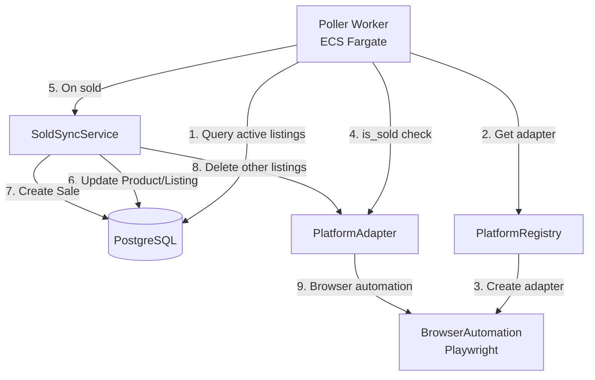
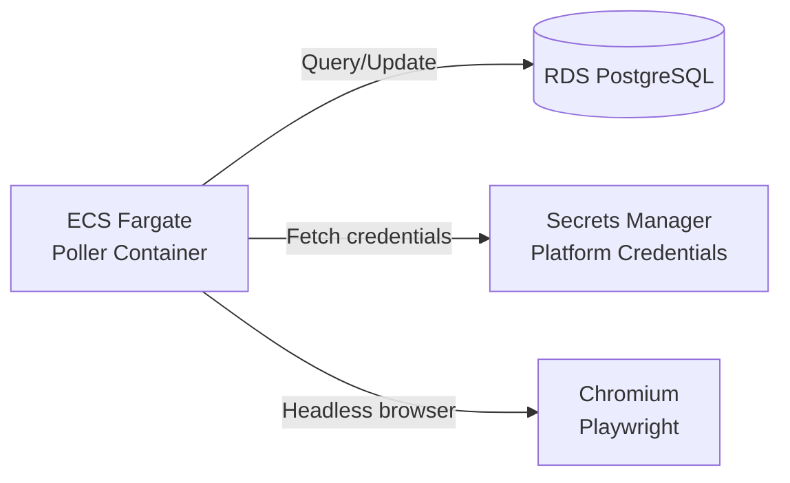
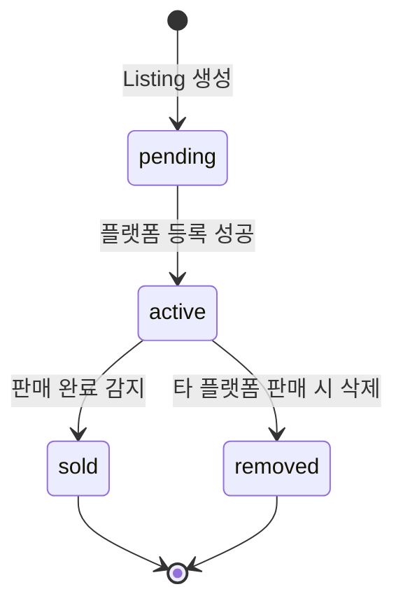

# Design Document: Sold Listing Auto Sync

## Overview

**Feature Name:** sold-listing-auto-sync

**목적:** 하나의 플랫폼에서 상품이 판매 완료되면, 나머지 플랫폼에서 자동으로 삭제하여 중복 판매를 방지하고 SSOT(Single Source of Truth) 원칙을 유지합니다.

**핵심 플로우:**
1. Poller가 60초마다 모든 active 리스팅을 조회
2. 각 리스팅의 플랫폼에서 `is_sold()` 확인
3. 판매 완료 감지 시 `SoldSyncService.sync_sold()` 호출
4. Product 상태를 sold로 변경, Sale 레코드 생성
5. 나머지 플랫폼에서 리스팅 삭제 (`delete_listing()`)
6. 부분 실패 격리: 한 플랫폼 실패가 다른 플랫폼에 영향 없음

**SSOT 원칙:** Product 엔티티가 유일한 원본. 모든 플랫폼 리스팅은 Product 상태에 따라 동기화됩니다.

## Architecture

### Component Diagram



### Deployment Architecture



**배포 옵션:**
- **ECS Fargate (권장)**: 상시 실행 워커. 60초 폴링 루프. Graceful shutdown 지원.
- **EventBridge + Lambda (대안)**: 분당 1회 트리거. Cold start 고려 필요. Chromium 레이어 크기 제약.

**ECS Fargate 선택 이유:**
- 브라우저 인스턴스 재사용으로 성능 향상
- 메모리 제약 없음 (Lambda 10GB vs Fargate 30GB)
- Graceful shutdown으로 진행 중인 폴링 보호


## Components and Interfaces

### 1. Poller Worker

**책임:**
- 60초마다 모든 active 리스팅 폴링
- 판매 완료 감지 시 SoldSyncService 트리거
- Graceful shutdown 처리

**인터페이스:**

```python
async def poll_once() -> None:
    """Active 리스팅을 1회 폴링하고 판매 완료 감지 시 sync_sold 호출"""

async def run() -> None:
    """폴링 루프 (Fargate 상시 워커용)"""
```

**주요 로직:**
1. DB에서 `Listing.status = active` 조회 (JOIN Product, PlatformAccount)
2. 플랫폼별로 그룹핑하여 브라우저 인스턴스 재사용
3. 각 리스팅에 대해 `adapter.is_sold()` 호출
4. True 반환 시 `SoldSyncService.sync_sold(product_id, listing_id)` 호출
5. 플랫폼별 오류는 로깅 후 다음 플랫폼 계속

**브라우저 인스턴스 재사용 전략:**
```python
# 플랫폼별로 단일 브라우저 인스턴스 생성 → 여러 리스팅 검사에 재사용
browsers = {}
for platform, listings in grouped_by_platform.items():
    browser = browsers.get(platform) or await create_browser(platform)
    browsers[platform] = browser
    for listing in listings:
        await adapter.is_sold(credentials, listing.platform_product_id)
```


### 2. SoldSyncService

**책임:**
- Product 상태를 sold로 변경
- Sale 레코드 생성
- 나머지 플랫폼 리스팅 삭제 (부분 실패 격리)

**인터페이스:**

```python
@dataclass
class SyncResult:
    """동기화 결과"""
    product_id: uuid.UUID
    sold_listing_id: uuid.UUID
    deleted_count: int
    failed_count: int
    failed_platforms: list[str]

async def sync_sold(
    db: AsyncSession,
    product_id: uuid.UUID,
    sold_listing_id: uuid.UUID
) -> SyncResult:
    """판매 완료 동기화. 나머지 플랫폼에서 삭제."""
```

**주요 로직:**
1. **동시성 체크**: Product.status 확인. 이미 sold면 조기 반환 (중복 방지)
2. **트랜잭션 시작**: Product/Listing/Sale 업데이트를 원자적으로 처리
3. **Product 업데이트**: `Product.status = sold`
4. **Listing 업데이트**: 판매된 리스팅 `status = sold`
5. **Sale 생성**: product_id, listing_id, platform, sold_at 기록
6. **트랜잭션 커밋**
7. **나머지 리스팅 삭제**: active 리스팅 조회 (sold_listing 제외)
8. **순차 삭제** (부분 실패 격리):
   - 각 리스팅마다 try-except 블록
   - 성공 시: `Listing.status = removed`
   - 실패 시: 오류 로깅, 카운트, 다음 리스팅 계속
9. **결과 반환**: SyncResult (성공/실패 개수, 실패 플랫폼 목록)


**부분 실패 격리 구현:**

```python
deleted_count = 0
failed_count = 0
failed_platforms = []

for listing in other_listings:
    try:
        adapter = get_adapter(listing.platform, browser)
        credentials = await load_credentials(listing.platform_account_id)
        await adapter.delete_listing(credentials, listing.platform_product_id)
        
        listing.status = ListingStatus.removed
        await db.commit()
        deleted_count += 1
        
    except PlatformError as e:
        logger.error(f"Failed to delete listing {listing.id} on {listing.platform}: {e}")
        failed_count += 1
        failed_platforms.append(listing.platform)
        # 다음 리스팅 계속
```

**트랜잭션 범위:**
- **Product/Listing/Sale 업데이트**: 단일 트랜잭션 (원자성 보장)
- **개별 삭제 작업**: 각각 별도 트랜잭션 (부분 실패 격리)

### 3. PlatformAdapter Interface

**기존 인터페이스 활용** (최소 변경):

```python
class PlatformAdapter(ABC):
    platform: str
    
    @abstractmethod
    async def is_sold(self, credentials: Credentials, platform_product_id: str) -> bool:
        """판매 완료 여부 확인"""
    
    @abstractmethod
    async def delete_listing(self, credentials: Credentials, platform_product_id: str) -> None:
        """플랫폼에서 리스팅 삭제"""
```

**FormPlatformAdapter 구현:**

이미 `base.py`에 선언적 스펙 기반 구현이 존재합니다:

```python
async def is_sold(self, credentials: Credentials, platform_product_id: str) -> bool:
    page = await self.browser.new_page()
    await self._login(page, credentials)
    await page.goto(self.spec.listing_url_template.format(id=platform_product_id))
    text = await page.text_content(self.spec.sold_selector)
    return bool(text) and self.spec.sold_marker in text

async def delete_listing(self, credentials: Credentials, platform_product_id: str) -> None:
    page = await self.browser.new_page()
    await self._login(page, credentials)
    await page.goto(self.spec.manage_url_template.format(id=platform_product_id))
    await page.click(self.spec.delete_selector)
    await page.click(self.spec.delete_confirm_selector)
```

**플랫폼별 스펙 완성 필요:**

현재 bunjang/karrot/charan 어댑터의 다음 필드가 비어있습니다:
- `listing_url_template`: 상품 상세 페이지 URL
- `sold_selector`: "판매완료" 표시 셀렉터
- `manage_url_template`: 상품 관리 페이지 URL
- `delete_selector`: 삭제 버튼 셀렉터
- `delete_confirm_selector`: 삭제 확인 버튼 셀렉터


### 4. Credentials Management

**설계:**
- `PlatformAccount.credential_key`: Secrets Manager 키 참조 (예: `parapara/platform/user123/bunjang`)
- 실제 자격증명(username/password/session)은 AWS Secrets Manager에 저장
- Poller/SoldSyncService는 credential_key로 조회

**인터페이스:**

```python
async def load_credentials(credential_key: str) -> Credentials:
    """Secrets Manager에서 자격증명 로드"""
    # boto3 get_secret_value 호출
    # JSON 파싱: {"username": "...", "password": "..."}
    # Credentials 객체 반환
```

**보안 원칙:**
- 로그/오류 메시지에 평문 자격증명 금지
- PlatformError 메시지는 credential_key만 참조
- 예: `"Failed to delete on bunjang (key: parapara/platform/user123/bunjang)"`

## Data Models

### Database Schema

**변경 사항:** Sale 테이블 추가 (이미 구현됨)

```python
class Sale(Base):
    __tablename__ = "sales"
    
    id: Mapped[uuid.UUID] = mapped_column(primary_key=True, default=uuid.uuid4)
    product_id: Mapped[uuid.UUID] = mapped_column(ForeignKey("products.id"))
    listing_id: Mapped[uuid.UUID] = mapped_column(ForeignKey("listings.id"))
    platform: Mapped[str] = mapped_column(String(50))
    sold_at: Mapped[datetime] = mapped_column(DateTime, default=datetime.utcnow)
```


**상태 전이:**



**Product 상태:**
- `draft` → `listing` → `listed` → `sold`
- `sold` 상태는 불가역 (한번 sold면 되돌릴 수 없음)

**Listing 상태:**
- `pending` → `active` → `sold` | `removed`
- `sold`: 해당 플랫폼에서 판매됨
- `removed`: 타 플랫폼 판매로 인한 삭제

### Query Patterns

**Poller가 사용하는 쿼리:**

```python
# 모든 active 리스팅 조회 (JOIN으로 필요한 정보 한번에)
query = (
    select(Listing, Product, PlatformAccount)
    .join(Product, Listing.product_id == Product.id)
    .join(PlatformAccount, Listing.platform_account_id == PlatformAccount.id)
    .where(Listing.status == ListingStatus.active)
    .where(Product.status != ProductStatus.sold)  # 이미 sold인 경우 제외
)
```

**SoldSyncService가 사용하는 쿼리:**

```python
# 1. Product 조회 (동시성 체크용)
product = await db.get(Product, product_id)
if product.status == ProductStatus.sold:
    return  # 이미 처리됨


# 2. 나머지 active 리스팅 조회 (sold_listing 제외)
other_listings = (
    await db.execute(
        select(Listing)
        .where(Listing.product_id == product_id)
        .where(Listing.status == ListingStatus.active)
        .where(Listing.id != sold_listing_id)
    )
).scalars().all()
```

## Error Handling

### Error Categories

**1. 플랫폼 오류 (PlatformError)**
- 로그인 실패, 페이지 로드 타임아웃, 셀렉터 미발견
- **처리**: 로깅 후 다음 리스팅 계속
- **재시도**: 다음 폴링 사이클에서 자동 재시도

**2. 데이터베이스 오류**
- 연결 실패, 트랜잭션 충돌
- **처리**: 로깅, Sentry 알림
- **재시도**: Poller 재시작 시 자동 복구

**3. Secrets Manager 오류**
- 자격증명 조회 실패, 권한 부족
- **처리**: 로깅, 해당 플랫폼 건너뛰기
- **재시도**: 다음 폴링 사이클

### Logging Strategy

**로그 레벨:**
- `INFO`: 폴링 사이클 시작/완료, 판매 감지, 삭제 성공
- `WARNING`: 개별 플랫폼 오류 (재시도 가능)
- `ERROR`: 데이터베이스 오류, Secrets Manager 오류 (관리자 개입 필요)

**로그 포맷:**
```python
logger.info(
    f"Sold detected: product={product_id}, listing={listing_id}, platform={platform}"
)


logger.warning(
    f"Failed to delete listing: listing_id={listing.id}, "
    f"platform={listing.platform}, error={str(e)}"
)

logger.error(
    f"Failed to load credentials: key={credential_key}, error={str(e)}"
)
```

**비밀 정보 보호:**
- 자격증명 값(username/password/token)은 로그에 절대 포함 금지
- credential_key만 참조
- PlatformError 메시지는 자격증명 미포함 검증

### Retry Logic

**Poller 레벨 재시도:**
- 폴링 실패 시 다음 60초 사이클에서 자동 재시도
- 영구 실패 리스팅은 매 사이클마다 재시도 (수동 개입까지)

**삭제 실패 처리:**
- 삭제 실패한 리스팅은 `status = active` 유지
- 다음 폴링 사이클에서 Product가 sold이므로 폴링 대상에서 제외
- **수동 정리 필요**: 관리자가 실패 원인 해결 후 수동 삭제

**미래 개선 (이번 MVP 범위 밖):**
- 재시도 카운터 추가: `Listing.retry_count`
- 최대 재시도 초과 시 알림 발송
- Dead Letter Queue 패턴

## Testing Strategy

### Unit Tests

**SoldSyncService 테스트:**
- Mock DB, Mock Adapter
- 동시성 체크 (이미 sold인 경우)
- 부분 실패 격리 (일부 삭제 실패해도 나머지 진행)
- 트랜잭션 원자성 (Product/Listing/Sale 업데이트)
- SyncResult 반환값 검증

**PlatformAdapter 테스트:**
- Mock BrowserPage로 is_sold/delete_listing 시뮬레이션
- 셀렉터 미발견 시 PlatformError 발생 확인
- sold_marker 정확히 매칭하는지 확인

**Poller 테스트:**
- Mock DB, Mock SoldSyncService
- 브라우저 인스턴스 재사용 확인
- 플랫폼별 오류 격리 확인

### Integration Tests

**End-to-End 시나리오:**
1. 테스트 DB에 Product/Listing 생성 (3개 플랫폼)
2. Mock Browser로 한 플랫폼만 sold 반환
3. Poller 실행
4. Product.status = sold 확인
5. Sale 레코드 생성 확인
6. 나머지 2개 Listing status = removed 확인

**실제 플랫폼 연동 테스트 (선택):**
- 테스트 계정으로 실제 등록/삭제 수행
- 셀렉터 정확성 검증
- CI/CD에서는 건너뛰기 (수동 실행)

### Property-Based Testing

**이 기능은 PBT 적용 범위 밖:**
- 외부 서비스(플랫폼, DB) 의존성이 높음
- 상태 전이가 명확하고 경우의 수가 제한적
- Mock 기반 Unit Test로 충분히 검증 가능

**대신 사용할 테스트:**
- Unit Tests: 비즈니스 로직 (부분 실패, 동시성, 트랜잭션)
- Integration Tests: 실제 DB 연동, 엔드투엔드 플로우


## Deployment Configuration

### Environment Variables

```bash
# Poller 설정
POLLING_INTERVAL_SECONDS=60
BROWSER_HEADLESS=true

# 데이터베이스
DATABASE_URL=postgresql+asyncpg://...

# AWS
AWS_REGION=ap-northeast-2
SECRETS_MANAGER_PREFIX=parapara/platform

# 로깅
LOG_LEVEL=INFO
SENTRY_DSN=https://...
```

### ECS Task Definition

```json
{
  "family": "parapara-poller",
  "networkMode": "awsvpc",
  "requiresCompatibilities": ["FARGATE"],
  "cpu": "512",
  "memory": "1024",
  "containerDefinitions": [
    {
      "name": "poller",
      "image": "parapara-backend:latest",
      "command": ["python", "-m", "workers.poller"],
      "environment": [
        {"name": "POLLING_INTERVAL_SECONDS", "value": "60"},
        {"name": "BROWSER_HEADLESS", "value": "true"}
      ],
      "secrets": [
        {"name": "DATABASE_URL", "valueFrom": "arn:aws:secretsmanager:..."}
      ],
      "logConfiguration": {
        "logDriver": "awslogs",
        "options": {
          "awslogs-group": "/ecs/parapara-poller",
          "awslogs-region": "ap-northeast-2",
          "awslogs-stream-prefix": "ecs"
        }
      }
    }
  ]
}
```


### Dockerfile Updates

```dockerfile
# Playwright 설치
RUN pip install playwright==1.40.0
RUN playwright install chromium
RUN playwright install-deps

# 폰트 설치 (한글 지원)
RUN apt-get update && apt-get install -y \
    fonts-nanum \
    fonts-noto-cjk \
    && rm -rf /var/lib/apt/lists/*
```

### Graceful Shutdown

```python
import signal
import asyncio

shutdown_event = asyncio.Event()

def signal_handler(sig, frame):
    logger.info("Shutdown signal received, finishing current cycle...")
    shutdown_event.set()

signal.signal(signal.SIGTERM, signal_handler)
signal.signal(signal.SIGINT, signal_handler)

async def run() -> None:
    while not shutdown_event.is_set():
        await poll_once()
        try:
            await asyncio.wait_for(shutdown_event.wait(), timeout=60)
        except asyncio.TimeoutError:
            continue
    
    logger.info("Poller stopped gracefully")
```

## Performance Considerations

### Browser Instance Reuse

**문제:** 매 리스팅마다 브라우저 생성 시 성능 저하
**해결:** 플랫폼별 단일 브라우저 인스턴스 재사용

**구현:**
```python
browsers: dict[str, BrowserAutomation] = {}

for platform, listings in grouped_by_platform.items():
    if platform not in browsers:
        storage_state = f"auth/{user_id}_{platform}.json"
        browsers[platform] = PlaywrightBrowser(
            headless=True,
            storage_state=storage_state
        )
    
    adapter = get_adapter(platform, browsers[platform])
    for listing in listings:
        await adapter.is_sold(...)

# 폴링 사이클 완료 후 정리
for browser in browsers.values():
    await browser.close()
```


**성능 향상:**
- 브라우저 시작 시간 절약 (플랫폼당 1회만)
- 로그인 세션 재사용 (storage_state)
- 메모리 사용량 감소

### Concurrency Control

**문제:** 동일 Product의 여러 Listing에서 동시 판매 감지
**해결:** Product.status 체크로 중복 처리 방지

**시나리오:**
1. 번개장터 리스팅 sold 감지 → sync_sold 호출
2. 동시에 당근 리스팅 sold 감지 → sync_sold 호출
3. 첫 번째 호출이 Product.status = sold로 변경
4. 두 번째 호출은 이미 sold이므로 조기 반환

**구현:**
```python
async def sync_sold(db: AsyncSession, product_id: uuid.UUID, sold_listing_id: uuid.UUID):
    product = await db.get(Product, product_id)
    
    # 동시성 체크
    if product.status == ProductStatus.sold:
        logger.info(f"Product {product_id} already sold, skipping")
        return SyncResult(product_id, sold_listing_id, 0, 0, [])
    
    # 나머지 로직...
```

**트랜잭션 격리 레벨:**
- PostgreSQL 기본 `READ COMMITTED` 사용
- Product 업데이트는 트랜잭션 내부에서 원자적으로 처리
- Race condition 시 한 트랜잭션만 성공, 나머지는 조기 반환

### Database Indexing

**필수 인덱스:**
```sql
CREATE INDEX idx_listing_status_active ON listings(status) WHERE status = 'active';
CREATE INDEX idx_product_status ON products(status);
CREATE INDEX idx_listing_product_id ON listings(product_id);
```


**쿼리 최적화:**
- Poller는 JOIN으로 한 번에 필요한 데이터 로드
- N+1 쿼리 방지: `selectinload` 사용

## Security Considerations

### Secrets Management

**자격증명 저장:**
- AWS Secrets Manager에 JSON 형식 저장
- Key: `parapara/platform/{user_id}/{platform}`
- Value: `{"username": "...", "password": "...", "session_token": "..."}`

**IAM 정책:**
```json
{
  "Effect": "Allow",
  "Action": [
    "secretsmanager:GetSecretValue"
  ],
  "Resource": "arn:aws:secretsmanager:ap-northeast-2:*:secret:parapara/platform/*"
}
```

### Credential Rotation

**세션 만료 처리:**
- PlatformError 발생 시 로그인 재시도
- 실패 시 사용자에게 재인증 요청 알림

**미래 개선:**
- 세션 만료 감지 자동화
- 자동 재로그인 메커니즘

### Log Sanitization

**검증 체크리스트:**
- [ ] 로그에 username/password/token 포함 여부 확인
- [ ] PlatformError 메시지에 자격증명 미포함 확인
- [ ] Sentry 이벤트에 민감 정보 필터링 설정

**구현:**
```python
# 로그 필터
class SanitizeFilter(logging.Filter):
    def filter(self, record):
        # credential_key는 허용, 실제 값은 마스킹
        record.msg = re.sub(r'password["\']?\s*[:=]\s*["\']?[^"\'}\s]+', 
                           'password=***', record.msg)
        return True
```


## Migration Plan

### Phase 1: Core Implementation
1. `SoldSyncService` 구현
2. `Poller` 기본 구조 (브라우저 재사용 없이)
3. Unit Tests 작성

### Phase 2: Platform Adapter Completion
1. 번개장터/당근/차란 셀렉터 완성
   - DOM 캡처로 `sold_selector`, `delete_selector` 확정
2. FormPlatformAdapter의 `is_sold`, `delete_listing` 테스트
3. Mock Browser로 검증

### Phase 3: Performance Optimization
1. 브라우저 인스턴스 재사용 구현
2. 플랫폼별 그룹핑 로직 추가
3. 성능 테스트 (100개 리스팅 기준)

### Phase 4: Deployment
1. Dockerfile 업데이트 (Playwright 설치)
2. ECS Task Definition 작성
3. Secrets Manager 설정
4. CloudWatch Logs/Alarms 구성

### Phase 5: Monitoring
1. 폴링 주기당 처리 시간 메트릭
2. 삭제 성공/실패율 추적
3. 플랫폼별 오류율 대시보드

## Future Enhancements

**현재 MVP 범위 밖:**

1. **재시도 메커니즘 개선**
   - Listing.retry_count 필드 추가
   - 최대 재시도 초과 시 알림 발송
   - Exponential backoff

2. **웹훅 기반 실시간 감지**
   - 플랫폼 웹훅 지원 시 폴링 대신 이벤트 기반으로 전환
   - 60초 지연 제거

3. **삭제 이유 기록**
   - Sale.reason 필드: 'sold_elsewhere' | 'manual' | 'expired'
   - 분석 용도

4. **관리자 대시보드**
   - 삭제 실패한 리스팅 목록
   - 수동 삭제 버튼
   - 재시도 트리거


## Open Questions

1. **폴링 주기 최적화**: 60초가 적절한가? 더 자주 확인해야 하는가?
   - 답변 대기: 사용자 피드백 기반 조정

2. **삭제 실패 알림**: 어떤 채널로 알릴 것인가?
   - 옵션: 이메일, 인앱 알림, Slack
   - 답변 대기: 운영 정책 결정 필요

3. **플랫폼별 로그인 세션 관리**: storage_state 파일 갱신 주기는?
   - 답변 대기: 플랫폼별 세션 만료 정책 확인 필요

4. **동시 판매 감지 시나리오**: 정확히 같은 시각에 여러 플랫폼에서 판매되면?
   - 현재 설계: 첫 번째 감지된 플랫폼을 판매처로 기록
   - 개선 여지: 타임스탬프 비교로 실제 판매처 결정

## Acceptance Criteria Mapping

| Requirement | Design Component | Implementation |
|------------|------------------|----------------|
| 1.1 Active 리스팅 조회 | Poller.poll_once() | SELECT WHERE status=active |
| 1.2 is_sold 호출 | PlatformAdapter.is_sold() | FormPlatformAdapter 구현 |
| 1.3 sync_sold 트리거 | Poller → SoldSyncService | 함수 호출 |
| 1.4 60초 폴링 | Poller.run() | asyncio.sleep(60) |
| 1.5 오류 격리 | try-except 블록 | 플랫폼별 에러 처리 |
| 2.1 Product status 업데이트 | SoldSyncService | Product.status = sold |
| 2.2 Listing status 업데이트 | SoldSyncService | Listing.status = sold |
| 2.3 Sale 생성 | SoldSyncService | Sale 레코드 INSERT |
| 2.4 Sale 필드 | Sale 모델 | product_id, listing_id, platform, sold_at |
| 3.1 나머지 리스팅 조회 | SoldSyncService | SELECT active EXCEPT sold_listing |
| 3.2 delete_listing 호출 | PlatformAdapter | FormPlatformAdapter 구현 |
| 3.3 removed 상태 변경 | SoldSyncService | Listing.status = removed |
| 3.4 순차 삭제 | for loop | 플랫폼별 순회 |
| 4.1 삭제 실패 격리 | try-except | 각 리스팅마다 격리 |
| 4.2 실패 시 active 유지 | 트랜잭션 롤백 | except 블록에서 미변경 |
| 4.3 try-except 블록 | 구현 패턴 | 개별 삭제마다 적용 |
| 4.4 성공/실패 카운트 | SyncResult | deleted_count, failed_count |
| 5.1 오류 로깅 | logger.warning/error | 구조화된 로그 메시지 |
| 5.2 자격증명 비노출 | 로그 필터 | credential_key만 참조 |
| 5.3 API 키 비노출 | 환경변수 | .env, Secrets Manager |
| 5.4 PlatformError 메시지 | 예외 클래스 | 메시지에 자격증명 미포함 |
| 6.1 asyncio 지원 | async/await | 전체 스택 비동기 |
| 6.2 폴링 주기 환경변수 | POLLING_INTERVAL_SECONDS | os.getenv |
| 6.3 DB 초기화 | Poller.run() | engine 생성 |
| 6.4 Graceful shutdown | signal handler | SIGTERM/SIGINT 처리 |
| 7.1 중복 동기화 방지 | Product.status 체크 | 조기 반환 |
| 7.2 sold 체크 | SoldSyncService | if product.status == sold |
| 7.3 트랜잭션 원자성 | db.commit() | 단일 트랜잭션 |
| 8.1 is_sold 인터페이스 | PlatformAdapter | 기존 인터페이스 활용 |
| 8.2 delete_listing 인터페이스 | PlatformAdapter | 기존 인터페이스 활용 |
| 8.3 credentials 조회 | load_credentials() | Secrets Manager |
| 8.4 PlatformError 처리 | try-except | 로깅 후 계속 |

## Summary

이 설계는 **SSOT 원칙**에 따라 Product를 중심으로 모든 플랫폼 리스팅을 동기화합니다. **부분 실패 격리**를 통해 한 플랫폼의 오류가 다른 플랫폼에 영향을 주지 않으며, **브라우저 인스턴스 재사용**으로 성능을 최적화합니다. **동시성 제어**로 중복 처리를 방지하고, **비밀 정보 보호**로 운영 안정성을 확보합니다.

ECS Fargate 기반 배포로 안정적인 폴링을 제공하며, 기존 PlatformAdapter 인터페이스를 최소한으로 변경하여 코드 안정성을 유지합니다.
